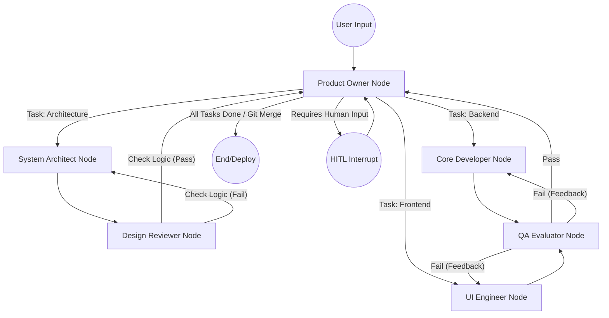

# HarnessCore AI - System Architecture

이 문서는 HarnessCore 멀티 에이전트 시스템을 구현하기 위한 핵심 시스템 아키텍처 및 상태/데이터 스키마 다이어그램을 정의합니다.

## 1. LangGraph 오케스트레이션 워크플로우

전체적인 에이전트 협업 과정은 LangGraph의 `StateGraph`를 통해 이루어집니다. `PO` 노드가 중심에서 입력 및 결정을 내리고, 하위 에이전트들로 작업을 라우팅합니다.



## 2. 에이전트 상태 구조 (Agent State - Pydantic)

LangGraph에서 엣지를 따라 순환할 에이전트 공통 `State` 스키마입니다. 각 에이전트가 처리 과정을 거치며 상태를 업데이트합니다.

```python
from typing import List, Dict, Any, Optional
from pydantic import BaseModel, Field

class TaskLog(BaseModel):
    agent_name: str
    action_type: str
    details: str
    status: str # "SUCCESS", "FAIL", "IN_PROGRESS"
    
class SystemState(BaseModel):
    user_prompt: str = Field(description="최초 사용자의 요구사항")
    current_assignee: str = Field(default="PO", description="현재 제어권을 가진 에이전트")
    tasks: Dict[str, str] = Field(default_factory=dict, description="PO가 분할한 Task 목록 (TaskID: Description)")
    completed_tasks: List[str] = Field(default_factory=list, description="완료된 TaskID 목록")
    file_changes: List[str] = Field(default_factory=list, description="현재 브랜치에서 변경된 파일 경로들")
    history_logs: List[TaskLog] = Field(default_factory=list, description="전체 에이전트의 수행 로그 (Checkpointer 연동)")
    latest_error: Optional[str] = Field(default=None, description="QA 에이전트가 검출한 최신 에러 메시지")
```

## 3. Database Schema 및 기술 스택 명세

시스템 구현을 위해 사용될 기술 스택과 PostgreSQL DB의 세부 스키마를 정의합니다.

### 3.1 코어 프레임워크 스펙
*   **Web Framework**: `FastAPI` (비동기 처리에 강력하며 Pydantic과 네이티브 통합 지원)
*   **Orchestration**: `LangGraph` (에이전트 제어 및 State 관리)
*   **Data Persistence**: `File System (JSON / Markdown)` (Custom BaseCheckpointSaver 구현)
*   **Validation**: `Pydantic v2`

### 3.2 File-Based State 저장 스키마 (No-DB Architecture)

데이터 가독성을 극한으로 끌어올리기 위해 SQLite를 포함한 일체의 DB 없이 완전한 '파일 기반 로컬 저장' 체제로 전환합니다.

*   **상태 논리 저장 (`.harness/state.json`)**:
    *   LangGraph 엔진의 재기동(Resume)과 타임트래블(Undo)을 위해 필수적인 원시 State 객체를 저장.
    *   사용자가 필요 시 직접 에디터로 열어 `current_assignee`나 `tasks` 내용을 실시간으로 강제 조작/수정 가능.
*   **사람 친화적 일지 (`.harness/journals.md`)**:
    *   각 에이전트가 어떤 도구를 호출했고 무슨 결과가 나왔는지 문장 형태로 요약 추가(Append Only).
    *   깃(Git) 커밋 이력처럼 사용자가 프로젝트 진행의 전반적 맥락을 쉽게 파악할 수 있는 핵심 리포트 역할 제공.

## 4. 로컬 Tool 실행 아키텍처

에이전트들은 로컬 환경에서 작업을 수행하기 위해 검증된 Tool Set을 주입받습니다.

1.  **GitTool**: `subprocess.run` 수행
    *   `git branch <new>`, `git commit`, `git checkout`, `git reset --hard`
2.  **FileIOTool**: Python 기본 File I/O (`os`, `shutil`) 수행
    *   제한 구역(Path Guard) 설정: 프로젝트 Base 디렉토리 밖의 파일에는 접근하지 못하도록 경로 이탈(`/../`) 검사 로직(Pathlib.resolve)을 내장.
3.  **ProcessControlTool**: 
    *   에이전트가 서버 재가동을 원할 때, 기존 실행중인 PID를 추적해 종료(`os.kill`) 후 재실행하는 백그라운드 프로세스 매니저.

## 5. 단계별 구현 마일스톤
- **Phase 1**: FastAPI 및 PostgreSQL Checkpointer 연동, 기본 PO-QA 에이전트 간의 단순 루프(Hello World 수준) 검증.
- **Phase 2**: File I/O Tool 및 Git Tool 구현, Core Developer 에이전트를 도입하여 지정 소스코드 변형 시도 확립.
- **Phase 3**: 통합 다중 에이전트(SA, CD, UI, DR) 라우팅 로직 정교화 및 Pydantic 에러 Self-Healing 모듈 장착.
- **Phase 4**: Textual 기반의 TUI 클라이언트 앱 구현 및 분리된 백엔드 API 연동.

## 6. 클라이언트-서버 분리 아키텍처 (UI Strategy)
향후 Web UI(2안)로의 매끄러운 확장을 위해 앱의 프론트엔드(TUI)와 백엔드(Core Engine)를 완전히 **이원화(Decoupling)** 하여 설계합니다.

*   **백엔드 (Core Engine - FastAPI)**: 시스템의 심장. LangGraph 라우팅 구동, PostgreSQL 체크포인트 관리 담당. UI에 독립적으로 구동되며 에이전트 상태 진행(State streaming)을 WebSocket이나 Server-Sent Events(SSE)로 클라이언트에 전송.
*   **프론트엔드 (UI Client - Textual/Rich)**: 철저히 상태 표시기(View) 역할 수행. 백엔드 API와 통신하여 터미널 창에 실시간 Diff, 채팅, 에러 로그 등을 화려하게 렌더링. 추후 동일 API 기반의 React/Vue 웹뷰 플랫폼으로 쉬운 대체 구조.

## 7. 런처 및 부트스트래핑 전략 (Single Command Execution)
이원화 아키텍처로 인한 사용자 경험(UX) 불편을 차단하기 위해 **단일 명령어 부트스트래퍼(Bootstrapper) 스크립트**를 엔트리포인트로 제공합니다. 사용자는 서버 두 개를 관리할 필요가 없습니다.

*   **`harness cli` 명령어 구동 (TUI 모드)**
    1. 스크립트가 FastAPI 백엔드 엔진을 **백그라운드 스레드(Daemon)**로 조용히 할당(`localhost:8000`).
    2. 메인 스레드에서는 즉시 Textual TUI 앱을 포그라운드로 시각화하여 로컬망에 연결.
    3. UI 창이 닫히면(사용자 종료) 백그라운드의 API 서버도 함께 안전하게 자동 종료(Graceful Teardown).
*   **`harness web` 명령어 구동 (Web 모드 - 확장 시)**
    1. FastAPI 엔진을 실행하되, 내부에서 정적 파일(React Build Static Files)을 함께 서빙.
    2. 파이썬이 OS 통신을 통해 사용자의 크롬 기본 브라우저를 강제 오픈(`http://localhost:8000`).
